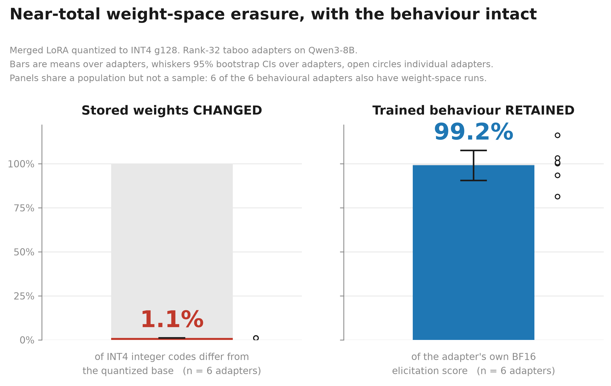

# Adapter Retention Under Post-Training Quantization

> **Status:** Phase 0 and Phase 1 complete. Manuscript drafted (`paper/`). Phase 2 not started — see *What we did not do*.
> 
> *This file is generated by `analysis/gen_readme.py` from `results/raw/**`. Do not edit by hand — regenerate.*

## What this is

When you fine-tune with LoRA, merge the adapter into the base weights, and quantize for deployment, does the adaptation survive? A rank-16 LoRA produces a small weight delta and 4-bit quantization has a coarse step size, so the delta may fall below the step and be numerically erased — in which case an "aligned quantized model" could be behaviourally the base model.

We measure the weights, then measure the behaviour on the same models.

## Headline finding

**At INT4 with group size 128 — the standard deployment configuration — 98.9% of the model's stored integer codes are unchanged, and 99.2% of the adapter's trained behaviour is retained.** Both measured on the same six adapters.



The weights really are almost untouched. The behaviour is not. These are the same measurement read at two levels, and the paper explains why.

## Read this

| | |
|---|---|
| **[The paper](paper/adapter-retention-arxiv.pdf)** (26 pp, arXiv format) | Start here. The argument, the channel model, and the four load-bearing results. |
| **[Technical report](paper/adapter-retention-technical-report.pdf)** (77 pp) | Same manuscript with every appendix inline: full tables, all prompt sets, and the reproduction instructions. For a reader checking the work rather than reading it. |
| **[Lab notebook](EXPERIMENTS.md)** (34 entries) | Append-only, including the experiments that failed, the ones that were misconfigured and the ones that answered nothing. Read the [supersession index](EXPERIMENTS.md#-supersession-index--read-before-quoting-any-number-from-this-file) before quoting any number from it. |

The corrections are the entries worth reading. Three metric definitions and one scaling convention were wrong, each caught by measurement before it reached a figure; one wrong citation survived the whole project.

## Will *my* adapter survive? — `ar.predict`

No adapter card publishes effective magnitude, so retention cannot currently be predicted from published metadata. This computes it — no GPU, no training, ~150 MB of network.

```bash
PYTHONPATH=src python -m ar.predict \
  --adapter adamkarvonen/Qwen3-8B-taboo-smile_50_mix --bits 4 --group-size 128
```

**It predicts stored weights, not behaviour, and says so in its own output.** Finding 4 below is a measured limit on the tool we ship: it cannot tell you which of two similar adapters will survive.

## What we found

**1. One ratio governs weight-space retention, with no fitted parameters.** `|Δ|/s` — the adapter's per-weight magnitude against the quantization step — predicts the code-flip rate of every adapter tested to within **2.3%**, across two base models, four ranks (16–128), both scaling conventions and four training regimes. What licenses the closed form is measured, not assumed: trained deltas carry no information about quantization bin position (correlation < 0.0011).

| adapter | base | r | scaling | cosine | code-flip | rel. error | output SNR |
|---|---|---|---|---|---|---|---|
| taboo-moon | Qwen3-8B | 32 | 2.00 | 0.137 | 1.09% | 7.42 | 1.62 |
| taboo-smile | Qwen3-8B | 32 | 2.00 | 0.137 | 1.09% | 7.41 | 1.63 |
| taboo-snow | Qwen3-8B | 32 | 2.00 | 0.138 | 1.10% | 7.37 | 1.63 |
| taboo-gold | Qwen3-8B | 32 | 2.00 | 0.139 | 1.11% | 7.35 | 1.63 |
| taboo-rock | Qwen3-8B | 32 | 2.00 | 0.141 | 1.14% | 7.21 | 1.67 |
| taboo-ship | Qwen3-8B | 32 | 2.00 | 0.141 | 1.14% | 7.23 | 1.66 |
| latentqa | Qwen3-8B | 64 | 2.00 | 0.276 | 3.88% | 3.58 | 2.53 |
| responsible-ai-safety | Llama-3.1-8B | 16 | 2.00 | 0.330 | 6.19% | 2.90 | 6.00 |
| ao-v3-dpo-halluc | Qwen3-8B | 128 | 1.41 (rsLoRA) | 0.505 | 14.81% | 1.74 | 3.76 |

Relative error is measured against an **erasure baseline of 1.0**: every adapter receives an effective update larger than the one it asked for, pointing somewhere it did not.

**2. Behaviour degrades monotonically, and only at coarser settings.** Elicitation retention across six taboo adapters: **99.2%** at INT4 g128, **77.2%** at INT4 per-channel, **57.8%** at INT3 g128 (95% CI over adapters at INT4 g128: [90.6%, 107.6%]).

**3. Where behaviour degrades, it degrades benignly.** The trained *capability* weakens while the trained *constraint* holds — the model becomes less able to express the behaviour, not more likely to violate it. This is the opposite of the alarming failure mode, and the opposite of what we predicted before withdrawing that prediction on evidence.

**4. Weight-space measurement does not predict behavioural outcomes — including our own tool's.** Within six adapters matched on rank, scaling, base model, recipe *and* predicted output SNR to within 3.3%, behavioural retention spans **28.7% to 86.4%** at INT3. Among the pairs whose difference is statistically resolvable, the ordering runs **opposite** to the predictor. The adapter with the largest weight-space footprint in the study has no measurable target behaviour at all.

**5. An adapter marketed for safety adds no refusal to its base.** On direct harmful prompts the base `Llama-3.1-8B-Instruct` already refuses 16/16 at ceiling; the adapter clears no axis of the instrument gate, and on 2 of 8 jailbreak-framed prompts it *removes* refusal the base model has. n=2, one adapter, BF16 — a case study, not a population estimate.

**6. The early-layer bit-flip spike is not the activation-outlier phenomenon.** It is the inverse: the weight groups driving it sit at the **quietest** input channels (0.15–0.19× the module mean). Existing outlier-aware quantizers select what to protect by *high* activation, so they would not protect these — a concrete, falsifiable prediction we state and do not test.

## Scope: what these numbers do and do not say

Weight-space results are statements about **stored weights**. They are not statements about behaviour, and this paper's central finding is that the two dissociate. Behavioural results cover **rank-32, α/r = 2 adapters on one base model from one training recipe** — they do not inherit the rank and convention coverage of the weight-space measurements.

## What we tried that did not work

- **A forced-reveal capability probe** returned near-identical values on models with obviously different behaviour — it asks the model to complete the one frame its training suppresses. Deprecated. ([EXP-014](EXPERIMENTS.md#2026-07-30-exp-014-first-phase-1-batch--pipeline-works-both-metrics-do-not))
- **Our first instrument gate certified that broken probe**, because it used `OR` and because Cohen's *d* returns `inf` under zero pooled variance. Rebuilt conjunctive, with a self-test that rejects the known-bad probe. ([EXP-015](EXPERIMENTS.md#2026-07-30-exp-015-the-gate-certified-a-broken-instrument-rebuilt-and-p7-withdrawn-on-evidence))
- **A subspace probe drawn through the adapter's own factor matrix** imported that matrix's spectrum and appeared to refute the amplification law. An orthonormal basis recovered the law to within 1%. ([EXP-009](EXPERIMENTS.md#2026-07-30-exp-009-output-space-snr-bin-position-independence-spike-decomposition-and-a-failed-prediction) → [EXP-010](EXPERIMENTS.md#2026-07-30-exp-010-correction-to-exp-009--the-amplification-law-holds-and-the-dpo-prediction-was-right))
- **A hardcoded α/r scaling** understated one rank-128 rsLoRA adapter's delta by 11.3×, corrupting four prior analyses and one registered prediction. ([EXP-011](EXPERIMENTS.md#2026-07-30-exp-011-rslora-scaling-bug--one-adapters-delta-was-113x-too-small-in-every-prior-entry))
- **The safety adapter's refusal battery did not validate**, so its registered prediction was withdrawn rather than tested against a weaker instrument. ([EXP-017](EXPERIMENTS.md#2026-07-31-exp-017-refusal-battery-for-the-safety-adapter--instrument-does-not-validate-and-the-adapter-is-not-a-refusal-strengthener-against-its-base))
- **The across-population predictive test was not run.** The predictor range collapsed when the safety adapter failed validation, and the result would have remained confounded. Decision and falsifier recorded before the fact. ([EXP-023](EXPERIMENTS.md#2026-08-03-exp-023-full-draft-number-audit-supersession-index-and-the-four-load-bearing-figures))
- **We cited the wrong paper for the Taboo model organisms** for the duration of the project — a plausible id, real paper, right authors, adjacent topic. ([EXP-019](EXPERIMENTS.md#2026-07-31-exp-019-correction--the-taboo-model-organisms-were-cited-to-the-wrong-arxiv-paper-in-every-prior-entry))

## What we did not do

Phase 2 (quantization × alignment drift in the ATP testbed) was **not started**. The Phase 0+1 result stands on its own and the conditional gate for Phase 2 was not the binding constraint — the decision is recorded in the plan with its reasoning and what would reverse it.

## Reproduce

Full instructions, pinned versions, expected runtimes and expected outputs: **[paper/appendix-D-reproduction.md](paper/appendix-D-reproduction.md)**.

No gated repositories are required. If your GPU is not Blackwell, set `AR_MIN_CAPABILITY=8.0`.

```bash
pip install torch==2.11.0 --index-url https://download.pytorch.org/whl/cu128
pip install -r requirements.txt
PYTHONPATH=src python -m pytest -q                      # 128 passed
PYTHONPATH=src python analysis/audit_draft_numbers.py   # 143/143 claims vs raw
```

The audit re-derives every number in the paper *and in this file* from `results/raw/**`. It is the check that would catch this README going stale.

## Repo layout

```
paper/            manuscript, appendices, figures, both PDFs
src/ar/           quantsim, retention, adapters, evaluate, predict, device
analysis/         table + figure generators, audits, cross-checks
scripts/          measurement drivers and validation gates
results/raw/**    every record, at the finest granularity logged
docs/             the process record: plan, prior art, outline, read-through
EXPERIMENTS.md    append-only lab notebook, with a supersession index
```

## Prior work and how this differs

LoftQ and QA-LoRA are motivated by the same interaction but change the *training* procedure; GPTQ-intrinsic LoRA bounds layer-wise *reconstruction error*. None reports what a published, already-trained adapter retains under a deployment quantizer, which is the gap this fills. We also reconcile an apparently opposite result — that compressing delta weights *protects* alignment — as the same law evaluated at the other end of `|Δ|/s`, distinguished by which tensor sets the quantization scale. See [docs/PRIOR_ART.md](docs/PRIOR_ART.md) and §2 of the paper.

## Citing this work

Unpublished. There is no arXiv identifier yet, and this block will not invent one — cite the repository until there is.

```bibtex
@misc{adapter_retention_2026,
  author = {Maxim},
  title  = {Near-Total Weight-Space Erasure Without Behavioural Collapse:
            What Survives When a Merged LoRA Is Quantized},
  year   = {2026},
  note   = {Manuscript and raw records: <REPO-URL>},
}
```

## Licence

MIT — see [LICENSE](LICENSE).
